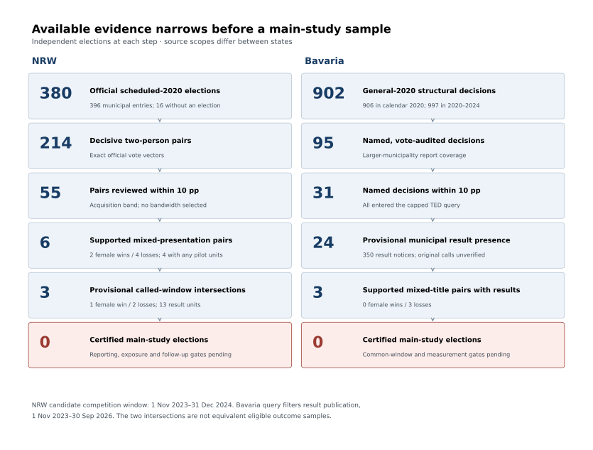
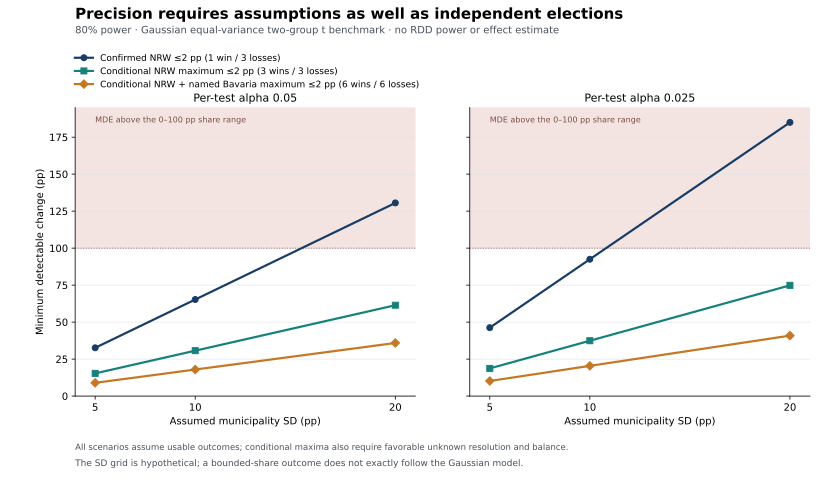

# Can German Municipal Data Support a Female-Mayor Procurement Study?

*A Bounded Feasibility Audit in NRW and Bavaria*

**Version 0.1, 9 October 2026. Draft for review. Evidence cutoff: 5 October 2026.** Independent second coding has not been completed. This report contains a source and design-feasibility assessment, not an estimated procurement effect.

**This project explicitly adapts Florio and Spagnolo's (2026) Italian paper, *Female Mayors and Public Procurement*, to Germany.** It builds on existing German research, particularly Schild (2013), Baskaran and Hessami (2018; 2025), Arnold (2018) and Frank, Stadelmann and Torgler (2023). The contribution assessed here is the feasibility of a German procurement application; neither novelty nor successful replication is established.

## Abstract

We assess whether accessible German municipal election and procurement sources support a close-election study of electing a female-presented candidate rather than her actual opponent. The audit validates 380 scheduled-2020 mayoral elections in North Rhine-Westphalia (NRW), identifies 214 decisive two-person comparisons and reviews all 55 pairs within ten percentage points. Six pairs have historically supported mixed public presentation; only 4 lie within two percentage points, with 1 female-presented win and 3 losses. The candidate common-window intersection contains 3 provisionally linked mixed pairs and 13 observed result units, without certified reporting, exposure, follow-up or deduplication. A bounded Bavaria route tests 31 named close elections, recovering 350 provisionally municipal result notices across 24 municipalities. Historical candidate measurement remains incomplete; the 3 supported mixed-title pairs all have female losses. Even a favorable twelve-election scenario requires an effect of 1.80 municipality standard deviations for 80% power in a simplified Gaussian two-group benchmark. This is not RDD power. The evidence supports a no-go for the current causal launch and a reproducible feasibility/data report. It does not establish a zero effect or the impossibility of a future German study. Independent coding and a materially stronger joint candidate–outcome source route are prerequisites for reopening.

## 1. Research question and German precedents

The intended application asks whether municipal procurement differs after a close election between a female-presented candidate and her male-presented opponent. Florio and Spagnolo (2026) motivate the procurement question and decisive-election design. Their inspected CEIS edition uses Italian electoral and ANAC procurement records, with outcome-specific procedure populations and attention to the timing of procurement publication. German administrative sources, reporting categories and mayoral calendars require separate validation.

Related German research already provides substantial groundwork. Schild (2013) studies female Bavarian mayors and municipal fiscal decisions using richer historical candidate fields. Baskaran and Hessami (2018) provide a direct Hesse female-mayor close-election precedent with subsequent political-representation outcomes. Their 2025 councillor study concerns a different treatment—one additional female council member—and childcare outcomes. Its same-party marginal-seat comparison does not hold party constant in a mayoral contest. Arnold (2018) informs historical Bavarian election coverage and round linkage. Frank et al. (2023) document larger-municipality sources and the distinctive March-2020 Bavarian postal-runoff setting.

We use these studies to assess source scope, treatment construction, independent assignment counts and institutional comparability. Their fiscal, representation or childcare results do not establish German procurement effects. Access to an earlier author's historical register also does not establish access to equivalent contemporary fields in our public-source acquisition. The [literature crosswalk](../docs/feasibility/literature-design-crosswalk.md) identifies the editions actually examined and the available replication/access routes. Final-version differences remain unverified for several papers; this is a targeted review rather than a systematic novelty assessment.

### 1.1 Intended estimand and measurement

For an exhaustive mixed-presentation decisive pair, the proposed running variable is

$$r_i = 100\frac{V_{Fi}-V_{Mi}}{V_{Fi}+V_{Mi}}, \qquad T_i=\mathbf{1}\{r_i>0\}.$$

The denominator equals validated decisive-round valid votes in the retained exhaustive two-person comparisons. Thus a 51%–49% race has a two-percentage-point candidate-difference margin. It places the female candidate one percentage point above a 50% vote-share cutoff; the two scales are not interchangeable. All acquisition bands below use the candidate-difference scale. Ties and unresolved election identities cannot supply assignment.

A valid close-election interpretation would compare electing the specific female-presented candidate with electing her actual opponent near the cutoff. Party, experience and other candidate attributes can differ. It would not identify an isolated sex or gender effect holding the rest of the candidate constant. Our accepted historical public-presentation evidence is also distinct from a recorded administrative sex/gender field or self-reported identity. Registry fields, dated official or qualifying authored presentation, and name-based predictions retain separate provenance.

The proposed municipal fixed-window intention-to-treat target would preserve the original election assignment through later turnover. Restricting purchases to periods when the original winner remains in office creates a different, potentially selected exposure population. Neither target is estimated here. Direct mayoral participation in every purchasing decision is not assumed; municipal buyer/beneficiary scope and temporal exposure must nevertheless be established.

## 2. Sources, observation levels and audit methods

### 2.1 Election sources

The NRW official archive contains 396 municipal entries: 380 elections and 16 explicit no-election entries. The audit excludes 31 county-office entries from the mixed city/county export. All 380 election detail files and 1349 candidate records were checked. Exact decisive votes identify 214 structural two-person pairs. Candidate names and election results do not by themselves resolve sex/gender or full actual tenure histories.

GERDA (Heddesheimer et al., 2025), with the later mayoral extension cited by commit, supplies a useful state-specific compilation. It is not a federal register of all historically measured mayoral candidates. The Bavaria source comparison validates 997 structural decisions during 2020–2024, including 906 beginning in calendar 2020 and 902 beginning in the general election on 15 March 2020. These scopes are distinct. Official larger-municipality report PDFs recover 95 named, vote-audited decisions in that general cohort. Their coverage above 10,000 inhabitants creates a source-defined municipal-size restriction.

At the 5 October check, the later GERDA version `176259ea551b12a56dcd0c15b168e0e6e608f59a` left all 68929 Bavarian candidate rows semantically unchanged relative to our frozen `030c1fb865ec4e6ef94d5dee2039edde081a0f5d` acquisition. The 4574 rows for 2020–2024 still contained no candidate names or gender labels; all 1915 Bavarian labels belonged to 2026. The official current-officeholder XLSX dated 14 July 2026 contains 2056 municipal rows, 1919 with a 2026 election date, and no rows dated to a 2020 election. It does not provide the historical losing candidates. First-ever entry into office cannot automatically date a renewed term. These are dated source findings, not claims about releases after the evidence cutoff.

### 2.2 Procurement sources and reporting

The German Bekanntmachungsservice offers nationwide original eForms and converted exports. Its inspected documentation specifies an archive floor of December 2022. The provider describes mandatory above-EU-threshold publication from 25 October 2023, with less complete below-threshold submissions/imports. The project acquired 28 monthly archives—original XML and converted CSV for November 2023 through December 2024. An archive boundary or publication requirement does not certify universal, retrospective or outcome-specific completeness. The [national export audit](../docs/feasibility/national-procurement-open-data.md) preserves source-specific licensing, coverage and access findings.

Notices, versions, procedures, lots, results, tender statistics and contracts are different observation levels. An amendment may update an earlier notice. A result can cover several lots or contracts, and related lots may repeat a grouped statistic. Supplier or consortium blocks do not create additional bids or independent municipal elections. Source-linked relationships and correction histories are therefore retained rather than applying an arbitrary latest-row rule.

Only explicitly typed total-tender statistics supply the competition-count measure. Electronic submissions, SME bids, participation requests and other subsets do not replace missing totals. Tender counts measure submitted offers, not distinct firms. A single tender indicates limited observed competition; it does not prove corruption.

Original competition publication, winner selection, contract conclusion and result publication are kept separate. Results published later can concern an earlier competition. A no-call procedure needs its own supported timing rule; a missing acquired call is not evidence that no call existed. These distinctions matter both for exposure and comparable follow-up.

### 2.3 Bounded verification and reproducibility

The NRW close-pair audit examines every pair within ten percentage points, rather than only upstream prediction-based mixed leads. It applies the unchanged historical candidate-evidence codebook, records primary authorship and exact locators, and retains unknown or conflicting dispositions. The closest pairs received deliberate priority; search effort is not equal across the full inventory.

The Bavaria extension is one capped availability test of the existing named route. Its TED query selects Germany, declared city-name variants, local-authority legal type, standard result notices and publication from 1 November 2023 through 30 September 2026. Pagination, timeout flags, duplicate notice numbers and byte hashes are checked. German municipal buyer-text and legal-type matches remain provisional identities, with beneficiary scope unverified. The query's publication interval differs from NRW's candidate original-competition window.

The report itself is generated from a pinned set of public aggregate/event artifacts, with cross-artifact accounting checks. It neither reacquires source documents nor reads local person-level annotations. Source hashes identify the evidence used; they do not independently validate real bidding, every original publication or all upstream extraction choices. The [input manifest](report-inputs.json), [fact ledger](report-facts.json) and [build checkpoint](report-reproduction-checkpoint.json) separate report reproduction from original-source acquisition. The 15 baseline artifact pins remain unchanged.

## 3. Observed sample intersections

### 3.1 NRW: many records, few supported assignments

All 55 decisive pairs within ten percentage points have two candidate dispositions. They contain 6 supported mixed-presentation pairs, 10 supported same-presentation pairs and 39 unresolved pairs. Unresolved is not a same-presentation exclusion. The closest 15 pairs, within two percentage points, contain 4 mixed, 9 same and 2 unresolved pairs. Supported mixed assignments in that band comprise 1 female-presented win and 3 losses.

| Margin at most (pp) | Reviewed pairs | Supported mixed pairs | Female-presented wins | Female-presented losses |
| --- | --- | --- | --- | --- |
| 1 | 4 | 2 | 0 | 2 |
| 2 | 15 | 4 | 1 | 3 |
| 5 | 34 | 5 | 2 | 3 |
| 10 | 55 | 6 | 2 | 4 |

*Table 1. Exact inclusive acquisition bands from the official decisive votes. Bands are descriptive inventory restrictions, not selected RDD bandwidths. Presentation-supported pairs are not automatically outcome-eligible or independently second-coded.*

The retained procurement pilot contains 237 result notices and 123 observed dated/count result units across 6 elections, before complete deduplication. The source-checked unit classifications are 98 open, 17 negotiated with prior call, 5 restricted and 3 negotiated without prior call. These are classifications of observed result units, not shares of all unique municipal procedures.

Of those units, 115 have supported called-procedure chronology; 5 competitive cases remain unresolved, and 3 no-call cases need a separate timing rule. The acquisition also retains 37 buyer-scope cases pending review. Chronology support alone does not certify full exposure, reporting or earliest-ever publication.

Only 4 of the 6 supported mixed pairs have any existing dated/count pilot units. Restricting supported original called-procedure dates to the candidate 1 November 2023–31 December 2024 window leaves 3 mixed elections with 13 observed result units: 1 female-presented win and 2 losses.

| Supported mixed-pair municipality | Any pilot dated/count units | Called units in candidate window | Female-presented win |
| --- | --- | --- | --- |
| Iserlohn, Stadt | 44 | 0 | false |
| Velbert, Stadt | 45 | 10 | false |
| Geilenkirchen, Stadt | 18 | 2 | true |
| Unna, Stadt | 4 | 1 | false |
| Sendenhorst, Stadt | 0 | 0 | true |
| Wilnsdorf | 0 | 0 | false |

*Table 2. Provisional intersection of supported mixed-presentation elections with existing procurement observations. Counts precede complete deduplication. A zero is no supported pilot unit in that field/window, not zero purchasing. Different any-pilot periods cannot substitute for a comparable observation window.*

Viersen and Werdohl contribute dated/count units to the wider procurement pilot but have unresolved pair measurement. They therefore do not enter the supported mixed-pair intersection. The 13 units in the provisional intersection do not constitute 13 independently treated elections. Reporting coverage, procedure inventory, result maturity, exposure and analytic units remain pending; no main-study sample is certified.

### 3.2 Bavaria: scalable search does not solve historical measurement

| Margin at most (pp) | General-2020 structural | Named | Provisional result presence | Supported female wins | Supported female losses |
| --- | --- | --- | --- | --- | --- |
| 1 | 20 | 1 | 1 | 0 | 0 |
| 2 | 45 | 6 | 6 | 0 | 1 |
| 5 | 125 | 16 | 15 | 0 | 3 |
| 10 | 244 | 31 | 24 | 0 | 3 |

*Table 3. Bavaria general-2020 structural inventory, named subset and provisional TED result presence. Source scopes differ across columns. The female-win/loss columns concern supported mixed-title pairs only.*

The initial geographic-only query exceeded the predeclared cap; the local-authority restriction yielded 963 notices, acquired completely in four pages. Conservative text/type matching assigns 350 notices to 24 of the 31 named municipalities within ten percentage points. The remaining 613 notices are unmatched, ambiguous, multibuyer or nonsingle-local-authority cases. Aliases, outsourced purchasing and alternative buyer locations can create omissions, so this is query availability rather than a municipal procurement census.

The 3 supported mixed-title pairs all have female losses and together have 78 provisional result notices. Strict indexed extraction yields 35 single-lot total-tender counts across 6 municipalities, all with unresolved pair measurement. None belongs to a currently supported mixed-title pair. Missing indexed fields can still be present in original XML/PDF; they are not an outcome-absence finding.

Within two percentage points, the statewide general-2020 inventory contains 45 structural decisions, but the current named route contains only 6. That difference prevents a claim that the whole state's potential sample has been exhausted. It also identifies the missing bulk historical identity/measurement route. More result notices do not supply missing female-winner variation or a common original-competition cohort.



*Figure 1. Source-specific progression through observed evidence. Bavaria begins with structural decisions; NRW begins with all held elections, so the starting counts are not comparable attrition rates. The last row records uncompleted certification gates, not proof that every election is intrinsically unusable. Procurement intersections and reporting windows differ between the two audits.*

## 4. Selection, reliability and outcome denominators

### 4.1 Unequal evidence availability

| Dimension | Group | Supported candidate records | Candidate denominator | Support rate |
| --- | --- | --- | --- | --- |
| candidate election result | winner | 22 | 55 | 40.0% |
| candidate election result | loser | 18 | 55 | 32.7% |
| absolute margin band | within 2 pp | 27 | 30 | 90.0% |
| absolute margin band | over 2 to 10 pp | 13 | 80 | 16.2% |

*Table 4. Descriptive historical candidate-evidence support. Rates concern candidate records, not paired-election inclusion probabilities. Search priority and available sources differ across groups.*

The 22 supported winners (40.0%) and 18 supported losers (32.7%) show an availability difference. This neither proves selection bias nor establishes unbiased inclusion. Better-supported close pairs received more effort. Bavaria's named source subset selects larger municipalities. The audit does not yet harmonize validated pretreatment incumbency, municipal size/fiscal capacity or historical web-preservation measures. These missing comparisons limit assessment of selection into both candidate measurement and procurement observation.

Independent-review materials cover 28 NRW pairs and 56 candidate records: all 16 classified pairs plus 12 unresolved audit pairs. Prior labels, votes and margins are withheld, with the first-coder key stored separately. Original documents can reveal office or outcomes, so full blinding is not claimed. **No separate reviewer is assigned and no second coding has occurred.** Mechanical byte agreement and repeat reading by the first coder do not satisfy independence. Any future review must assess same-presentation exclusions and unknowns as well as included mixed pairs; disagreement can change the observed support counts.

### 4.2 Two nominated measurement questions

The narrowed scope nominates two outcome candidates: the share of unique in-scope procedures that use negotiated procedures, and the share of supported called-procedure result statistics with exactly one total tender. With-call and without-call categories remain separate. The latter is conditional on an observed result and a reported count; it is not the single-bid share of every municipal contract.

Both denominators can respond to the elected candidate and to reporting. Restricting to successful, completed or count-reporting results may introduce additional selection. Equal election weights address target weighting, not denominator selection. Undefined means/shares must remain undefined rather than zero. An all-category procedure-choice cohort cannot be claimed until no-call timing and the unique-procedure inventory are supported. The [outcome draft](../docs/feasibility/outcome-population-codebook.md) preserves these conditions.

Mean counts, values, winners and environmental/social/innovation fields remain secondary or conditional measurement extensions. Blank criteria fields do not establish absence of a policy or realized environmental performance. No municipal procurement rate or outcome contrast is computed in this report.

## 5. Early precision and cutoff support

### 5.1 Planning benchmark and assumptions

The precision screen precedes extensive further collection. It assumes independent election-level Gaussian outcomes with a common within-group standard deviation, equal election weights and a two-sided pooled t comparison. For group counts $n_1,n_0$, the standard error is proportional to

$$\sigma\sqrt{1/n_1+1/n_0}, \qquad \nu=n_1+n_0-2.$$

An effect of $d$ within-group standard deviations gives noncentrality $d/\sqrt{1/n_1+1/n_0}$. The MDE solves for 80% rejection probability using the two-sided critical value and small-sample variance uncertainty. The existing numerical audit checks null rejection, an independent noncentral-t reference and seeded raw-Gaussian simulation. These are validations of the declared benchmark, not empirical variance estimates or RDD inference.

The benchmark omits running-variable slopes, kernel weighting, bias correction, outcome selection and reporting uncertainty. Pretreatment adjustment could change residual variance. It is an optimistic planning comparison under its assumptions, not a universal lower bound, a sample-size sufficiency rule or design-specific RDD power. A single election on one side supplies no separately estimated group variance; the pooled calculation relies on its common-variance assumption.

| Scenario | Female wins | Female losses | MDE / SD, alpha .05 | MDE / SD, alpha .025 |
| --- | --- | --- | --- | --- |
| Confirmed NRW ≤2 pp | 1 | 3 | 6.53 | 9.25 |
| Conditional NRW maximum ≤2 pp | 3 | 3 | 3.07 | 3.74 |
| Conditional NRW + named Bavaria maximum ≤2 pp | 6 | 6 | 1.80 | 2.04 |

*Table 5. Gaussian pooled-t MDEs at 80% power, in municipality-level within-group SD units. “Conditional maximum” assumes favorable resolution of unknown presentation and usable outcomes for every counted election. Alpha .025 is a conservative Bonferroni allowance for two primary tests at family error .05. These are not certified samples.*

The confirmed NRW within-two-point configuration requires 6.53 SD at alpha .05. The favorable six-election NRW scenario requires 3.07 SD. Combining the tested named Bavaria route with NRW allows at most 12 potentially mixed elections in that band, with an ideal balanced MDE of 1.80 SD (2.04 at .025). This is a current named-route bound; it is not the maximum conceivable German sample or evidence supporting interstate pooling.



*Figure 2. MDEs rescaled using hypothetical municipality SDs of 5, 10 and 20 percentage points. The grid does not estimate variance or establish substantively meaningful effects. Values above 100 pp exceed the share outcome's possible change range; values below it are not thereby attainable at every baseline mean. A bounded share does not exactly follow the Gaussian model.*

For a hypothetical 10-pp SD, the favorable six-election scenario needs about 31 pp at alpha .05, while the twelve-election scenario needs about 18 pp. The relevant minimum effect and empirical variance remain undetermined. We therefore do not infer whether a specific policy-relevant effect is detectable. The no-go rests jointly on measurement, comparable linkage and side support, rather than a universal numerical power threshold.

Within ten points, the available named Bavaria plus NRW inventories admit an extremely optimistic maximum of 76 elections, assuming all unknown pairs become mixed and usable. This is not an acquisition forecast or reason to choose a wider bandwidth. Institutional pooling and continuity/local-randomization assumptions require independent justification. Additional result rows within one municipality cannot increase election-level assignment counts.

### 5.2 Algebraic support is necessary, not sufficient

A separate-slope local-linear model uses an intercept, assignment, margin and assignment–margin interaction. The four confirmed NRW pairs within two points have design-matrix rank three of four because only one female-presented candidate won. The three provisionally window-linked pairs likewise have rank three. Within one point there are no supported female wins.

Across the six supported mixed pairs within ten points, a local-linear matrix has full column rank, but a separate-side quadratic matrix has rank five of six because there are only two female wins. Thus those six elections alone cannot support a conventional separately fitted quadratic bias correction. Rank is an algebraic diagnostic; it does not validate continuity, bandwidth choice or inference. Alternative specifications cannot be adopted merely to rescue a small sample. No outcome regression is fitted.

## 6. Decision, limitations and reopening

The bounded decision is **no-go for the present public-source causal launch**. The available route establishes substantial reproducible data work but no certified common-period mixed-pair sample or useful support for the intended design. The completed output of this phase is a feasibility finding; the report remains a review draft. It does not establish that female mayors have no effect, a completed Italian replication, or the impossibility of future German causal research.

The larger statewide queue and potential provider-held data remain leads. Reopening requires a materially different inspectable bulk route to both historical finalists and consistently measured candidate attributes, additional independent elections on both cutoff sides, comparable procurement timing/coverage, explicit selection and independent coding. A justified minimum effect and outcome-specific design/precision assessment must precede main acquisition and preregistration. Older Hesse replication records are methods/access leads, not verified contemporary procurement samples. No authors or providers have been contacted.

The report's limitations are substantive: source-defined municipal and reporting coverage; selective and incomplete historical presentation evidence; unvalidated pretreatment selection covariates; unfinished exposure and no-call rules; unresolved procedure deduplication and follow-up; hypothetical variance assumptions; and missing independent coding. Byte-pinned reproduction cannot remove these limitations. A source-independent reproduction of every original pipeline and original publication was not performed in this report build.

The current research task is to review and complete this feasibility/data report, retaining those limitations. Broad collection and effect estimation remain on hold. GitHub Pages stays deferred until research completion and review of the permitted aggregate artifacts; no website is deployed by this report build.

## 7. Reproduction and data availability

The English Markdown report and standalone SVG/PDF/PNG figures are generated from public repository artifacts. The report source template contains fact placeholders resolved by the builder; counts, tables and chart values are cross-checked against separate pinned summaries, checkpoints and event matrices. A complete template, fact ledger, data for Figure 2 and input/output hashes are included. Report generation needs no private person files, credentials or network access.

From the repository root:

```sh
python -m pip install -r analysis/requirements-report.txt
python src/report/build_feasibility_report.py
python -m unittest discover -s tests
```

For the standalone report PDF, use `python src/report/build_feasibility_report.py --pdf` with Pandoc and XeLaTeX installed. `--facts-only` validates inputs and generates the fact ledger/Markdown without plotting. It is not a substitute for regenerating figure/PDF outputs. The original numerical benchmark requires its separate `analysis/requirements-feasibility.txt` environment; the report imports published benchmark values and does not rerun power calculations. Original-source acquisition/review is documented in the linked source-audit scripts and manifests.

Complete source publications, person-level annotations and reviewer keys remain local under the project's data-management rules. Published event-level availability does not imply permission to redistribute every upstream candidate dataset. The evidence commit is `5d986c617b3295ab987e538715d27b5d952e8bfb`; the report's later writing date does not refresh its frozen facts. Software and generated-output records are in the build checkpoint and verification record.

## References and editions consulted

Florio, Erminia, and Giancarlo Spagnolo. 2026. *Female Mayors and Public Procurement*. CEIS Research Paper 623, revised 3 July 2026. [CEIS PDF](https://ceistorvergata.it/RePEc/rpaper/RP623.pdf); [doi:10.2139/ssrn.7046899](https://doi.org/10.2139/ssrn.7046899). Inspected primary procurement/design edition; Italian results were not reproduced.

Schild, Christopher-Johannes. 2013. *Do Female Mayors Make a Difference? Evidence from Bavaria*. IWQW Discussion Paper 07/2013. [EconStor](https://hdl.handle.net/10419/81935). Inspected historical candidate/fiscal-design sections. The source sample is not our current procurement sample.

Baskaran, Thushyanthan, and Zohal Hessami. 2018. “Does the Election of a Female Leader Clear the Way for More Women in Politics?” *American Economic Journal: Economic Policy* 10(3): 95–121. [doi:10.1257/pol.20170045](https://doi.org/10.1257/pol.20170045). Methods/data inspected in [Konstanz Working Paper 2017-09](https://www.uni-konstanz.de/FuF/wiwi/workingpaperseries/WP_09_Baskaran_Hessami_2017.pdf); final-version differences and the [V1 replication package](https://doi.org/10.3886/E114710V1) contents remain unverified.

Baskaran, Thushyanthan, and Zohal Hessami. 2025. “Women in Political Bodies as Policymakers.” *Review of Economics and Statistics* 107(6): 1501–1517. [doi:10.1162/rest_a_01352](https://doi.org/10.1162/rest_a_01352). Methods/data inspected in the March-2023 [IZA Discussion Paper 15983](https://www.econstor.eu/bitstream/10419/272610/1/dp15983.pdf), a councillor/childcare study; final-version changes were not compared.

Arnold, Felix. 2018. “Turnout and Closeness: Evidence from 60 Years of Bavarian Mayoral Elections.” *Scandinavian Journal of Economics* 120(2): 624–653. [doi:10.1111/sjoe.12241](https://doi.org/10.1111/sjoe.12241). Institutional/data sections inspected in [DIW Discussion Paper 1462, 2015 edition](https://www.diw.de/documents/publikationen/73/diw_01.c.499182.de/dp1462.pdf); final article/supplement unavailable in the bounded review.

Frank, Marco, David Stadelmann, and Benno Torgler. 2023. “Higher Turnout Increases Incumbency Advantages: Evidence from Mayoral Elections.” *Economics & Politics* 35: 529–555. [doi:10.1111/ecpo.12226](https://doi.org/10.1111/ecpo.12226). Published data/methods and availability statement inspected. Name-derived gender and the 2020 postal-runoff regime require explicit comparability assessment.

Heddesheimer, Vincent, Hanno Hilbig, Florian Sichart, and Andreas Wiedemann. 2025. “GERDA: The German Election Database.” *Scientific Data* 12: 618. [doi:10.1038/s41597-025-04811-5](https://doi.org/10.1038/s41597-025-04811-5). Cite the later mayoral extension separately: [baseline commit](https://github.com/awiedem/german_election_data/commit/030c1fb865ec4e6ef94d5dee2039edde081a0f5d) and [checked later commit](https://github.com/awiedem/german_election_data/commit/176259ea551b12a56dcd0c15b168e0e6e608f59a). These files retain state-specific source and gender provenance.

Bauhr, Monika, and Nicholas Charron. 2021. “Will Women Executives Reduce Corruption? Marginalization and Network Inclusion.” *Comparative Political Studies* 54(7): 1292–1322. [doi:10.1177/0010414020970218](https://doi.org/10.1177/0010414020970218). Only the bounded indexed-primary design/dependent-variable reading was inspected; no original article/supplement was accepted. Single bidding is not proof of corruption.

Hessami, Zohal, and Mariana Lopes da Fonseca. 2020. “Female Political Representation and Substantive Effects on Policies: A Literature Review.” *European Journal of Political Economy* 63: 101896. [CESifo Working Paper 8155](https://www.ifo.de/DocDL/cesifo1_wp8155.pdf). The March-2020 working paper was consulted for synthesis and references; the final article was not compared.

## Appendix: audit trail and pending review

The [baseline snapshot](../docs/feasibility/baseline-snapshot.md), [NRW early memo](../docs/feasibility/early-feasibility-decision.md), [Bavaria route audit](../docs/feasibility/bavaria-bounded-route.md) and [bounded decision](../docs/feasibility/go-adapt-stop.md) retain their dated source scopes. The [primary literature manifest](../docs/feasibility/literature-source-manifest.csv) distinguishes downloaded originals, inspected older editions, indexed representations and failed-access records. The [independent-coding protocol](../docs/feasibility/independent-coding-protocol.md) records the prepared packet scope and the actual unfinished review status.

Before calling the research complete, review substantive interpretations and edition attribution, reconcile any reviewer changes against the pinned evidence, and record an explicit completed-report decision. The present draft must not be described as independently double-coded or externally validated. It preserves the no-go decision while making the work reviewable and reproducible.
